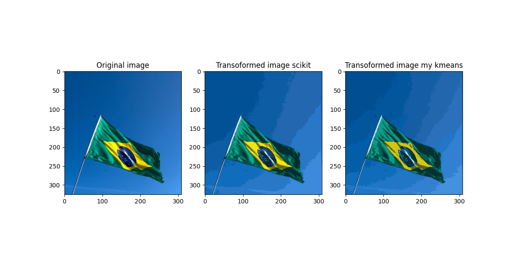

# Image_compression_kmeans
This little project is about kmeans from scratch to use it for image compression. All colours of the picture a clustered, so instead of representing a rgb picture be 2^24 colors it is only represented by n_clusters colors. Thats how information is reduced --> The image is compressed.

## Result
`img_compr.py` compares the kmeans from sklearn and mine written from scratch. It clusters the image colors into 16 clusters.

